# zheng
[](https://travis-ci.org/shuzheng/zheng)
[](LICENSE)
[](https://github.com/shuzheng/zheng/pulls)
[](https://github.com/shuzheng/zheng)
[](https://github.com/shuzheng/zheng)

交流QQ群：133107819、284280411、305155242🈵、528049386、157869467🈵、570766789🈵、601147566🈵、309985359🈵、336380857🈵、522723488、556447629、654558397🈵、392564561🈵、494594000🈵、494070275🈵、168267539🈵、652798487🈵、650979251🈵、622461564🈵、219381522🈵、487874426🈵、398342630🈵、205986087🈵、574153262🈵、606890936🈵、565434047🈵、680947971🈵、341884034🈵、562977817🈵、478962414🈵、679219230🈵、676766033🈵、621874750🈵、522903600🈵、524932879🈵、376261902🈵、481096887🈵、232104667🈵、637879277🈵、697575367🈵、702995203🈵、708665910🈵、697141239🈵、574057714🈵、631332162🈵、591739143🈵、731016871🈵、598738752🈵、748759166🈵、159816595(群内含各种工具、文档、视频教程下载)

## 前言

　　`zheng`项目不仅仅是一个开发架构，而是努力打造一套从 **前端模板** - **基础框架** - **分布式架构** - **开源项目** - **持续集成** - **自动化部署** - **系统监测** - **无缝升级** 的全方位J2EE企业级开发解决方案。

## 项目介绍

　　基于Spring+SpringMVC+Mybatis分布式敏捷开发系统架构，提供整套公共微服务服务模块：内容管理、支付中心、用户管理（包括第三方）、微信平台、存储系统、配置中心、日志分析、任务和通知等，支持服务治理、监控和追踪，努力为中小型企业打造全方位J2EE企业级开发解决方案。

### 组织结构

``` lua
zheng
├── zheng-common -- SSM框架公共模块
├── zheng-admin -- 后台管理模板
├── zheng-ui -- 前台thymeleaf模板[端口:1000]
├── zheng-config -- 配置中心[端口:1001]
├── zheng-upms -- 用户权限管理系统
|    ├── zheng-upms-common -- upms系统公共模块
|    ├── zheng-upms-dao -- 代码生成模块，无需开发
|    ├── zheng-upms-client -- 集成upms依赖包，提供单点认证、授权、统一会话管理
|    ├── zheng-upms-rpc-api -- rpc接口包
|    ├── zheng-upms-rpc-service -- rpc服务提供者
|    └── zheng-upms-server -- 用户权限系统及SSO服务端[端口:1111]
├── zheng-cms -- 内容管理系统
|    ├── zheng-cms-common -- cms系统公共模块
|    ├── zheng-cms-dao -- 代码生成模块，无需开发
|    ├── zheng-cms-rpc-api -- rpc接口包
|    ├── zheng-cms-rpc-service -- rpc服务提供者
|    ├── zheng-cms-search -- 搜索服务[端口:2221]
|    ├── zheng-cms-admin -- 后台管理[端口:2222]
|    ├── zheng-cms-job -- 消息队列、任务调度等[端口:2223]
|    └── zheng-cms-web -- 网站前台[端口:2224]
├── zheng-pay -- 支付系统
|    ├── zheng-pay-common -- pay系统公共模块
|    ├── zheng-pay-dao -- 代码生成模块，无需开发
|    ├── zheng-pay-rpc-api -- rpc接口包
|    ├── zheng-pay-rpc-service -- rpc服务提供者
|    ├── zheng-pay-sdk -- 开发工具包
|    ├── zheng-pay-admin -- 后台管理[端口:3331]
|    └── zheng-pay-web -- 演示示例[端口:3332]
├── zheng-ucenter -- 用户系统(包括第三方登录)
|    ├── zheng-ucenter-common -- ucenter系统公共模块
|    ├── zheng-ucenter-dao -- 代码生成模块，无需开发
|    ├── zheng-ucenter-rpc-api -- rpc接口包
|    ├── zheng-ucenter-rpc-service -- rpc服务提供者
|    └── zheng-ucenter-web -- 网站前台[端口:4441]
├── zheng-wechat -- 微信系统
|    ├── zheng-wechat-mp -- 微信公众号管理系统
|    |    ├── zheng-wechat-mp-dao -- 代码生成模块，无需开发
|    |    ├── zheng-wechat-mp-service -- 业务逻辑
|    |    └── zheng-wechat-mp-admin -- 后台管理[端口:5551]
|    └── zheng-ucenter-app -- 微信小程序后台
├── zheng-api -- API接口总线系统
|    ├── zheng-api-common -- api系统公共模块
|    ├── zheng-api-rpc-api -- rpc接口包
|    ├── zheng-api-rpc-service -- rpc服务提供者
|    └── zheng-api-server -- api系统服务端[端口:6666]
├── zheng-oss -- 对象存储系统
|    ├── zheng-oss-sdk -- 开发工具包
|    ├── zheng-oss-web -- 前台接口[端口:7771]
|    └── zheng-oss-admin -- 后台管理[端口:7772]
├── zheng-message -- 实时通知系统
|    ├── zheng-message-sdk -- 开发工具包
|    ├── zheng-message-server -- 服务端[端口:8881,SocketIO端口:8882]
|    └── zheng-message-client -- 客户端
├── zheng-shop -- 电子商务系统
└── zheng-demo -- 示例模块(包含一些示例代码等)
     ├── zheng-demo-rpc-api -- rpc接口包
     ├── zheng-demo-rpc-service -- rpc服务提供者
     └── zheng-demo-web -- 演示示例[端口:9999]
```

### 技术选型

#### 后端技术:
技术 | 名称 | 官网
----|------|----
Spring Framework | 容器  | [http://projects.spring.io/spring-framework/](http://projects.spring.io/spring-framework/)
SpringMVC | MVC框架  | [http://docs.spring.io/spring/docs/current/spring-framework-reference/htmlsingle/#mvc](http://docs.spring.io/spring/docs/current/spring-framework-reference/htmlsingle/#mvc)
Apache Shiro | 安全框架  | [http://shiro.apache.org/](http://shiro.apache.org/)
Spring session | 分布式Session管理  | [http://projects.spring.io/spring-session/](http://projects.spring.io/spring-session/)
MyBatis | ORM框架  | [http://www.mybatis.org/mybatis-3/zh/index.html](http://www.mybatis.org/mybatis-3/zh/index.html)
MyBatis Generator | 代码生成  | [http://www.mybatis.org/generator/index.html](http://www.mybatis.org/generator/index.html)
PageHelper | MyBatis物理分页插件  | [http://git.oschina.net/free/Mybatis_PageHelper](http://git.oschina.net/free/Mybatis_PageHelper)
Druid | 数据库连接池  | [https://github.com/alibaba/druid](https://github.com/alibaba/druid)
FluentValidator | 校验框架  | [https://github.com/neoremind/fluent-validator](https://github.com/neoremind/fluent-validator)
Thymeleaf | 模板引擎  | [http://www.thymeleaf.org/](http://www.thymeleaf.org/)
Velocity | 模板引擎  | [http://velocity.apache.org/](http://velocity.apache.org/)
ZooKeeper | 分布式协调服务  | [http://zookeeper.apache.org/](http://zookeeper.apache.org/)
Dubbo | 分布式服务框架  | [http://dubbo.io/](http://dubbo.io/)
TBSchedule & elastic-job | 分布式调度框架  | [https://github.com/dangdangdotcom/elastic-job](https://github.com/dangdangdotcom/elastic-job)
Redis | 分布式缓存数据库  | [https://redis.io/](https://redis.io/)
Solr & Elasticsearch | 分布式全文搜索引擎  | [http://lucene.apache.org/solr/](http://lucene.apache.org/solr/) [https://www.elastic.co/](https://www.elastic.co/)
Quartz | 作业调度框架  | [http://www.quartz-scheduler.org/](http://www.quartz-scheduler.org/)
Ehcache | 进程内缓存框架  | [http://www.ehcache.org/](http://www.ehcache.org/)
ActiveMQ | 消息队列  | [http://activemq.apache.org/](http://activemq.apache.org/)
JStorm | 实时流式计算框架  | [http://jstorm.io/](http://jstorm.io/)
FastDFS | 分布式文件系统  | [https://github.com/happyfish100/fastdfs](https://github.com/happyfish100/fastdfs)
Log4J | 日志组件  | [http://logging.apache.org/log4j/1.2/](http://logging.apache.org/log4j/1.2/)
Swagger2 | 接口测试框架  | [http://swagger.io/](http://swagger.io/)
sequence | 分布式高效ID生产  | [http://git.oschina.net/yu120/sequence](http://git.oschina.net/yu120/sequence)
AliOSS & Qiniu & QcloudCOS | 云存储  | [https://www.aliyun.com/product/oss/](https://www.aliyun.com/product/oss/) [http://www.qiniu.com/](http://www.qiniu.com/) [https://www.qcloud.com/product/cos](https://www.qcloud.com/product/cos)
Protobuf & json | 数据序列化  | [https://github.com/google/protobuf](https://github.com/google/protobuf)
Jenkins | 持续集成工具  | [https://jenkins.io/index.html](https://jenkins.io/index.html)
Maven | 项目构建管理  | [http://maven.apache.org/](http://maven.apache.org/)
Netty-socketio | 实时推送  | [https://github.com/mrniko/netty-socketio](https://github.com/mrniko/netty-socketio)

#### 前端技术:
技术 | 名称 | 官网
----|------|----
jQuery | 函式库  | [http://jquery.com/](http://jquery.com/)
Bootstrap | 前端框架  | [http://getbootstrap.com/](http://getbootstrap.com/)
Bootstrap-table | Bootstrap数据表格  | [http://bootstrap-table.wenzhixin.net.cn/](http://bootstrap-table.wenzhixin.net.cn/)
Font-awesome | 字体图标  | [http://fontawesome.io/](http://fontawesome.io/)
material-design-iconic-font | 字体图标  | [https://github.com/zavoloklom/material-design-iconic-font](https://github.com/zavoloklom/material-design-iconic-font)
Waves | 点击效果插件  | [https://github.com/fians/Waves](https://github.com/fians/Waves)
zTree | 树插件  | [http://www.treejs.cn/v3/](http://www.treejs.cn/v3/)
Select2 | 选择框插件  | [https://github.com/select2/select2](https://github.com/select2/select2)
jquery-confirm | 弹出窗口插件  | [https://github.com/craftpip/jquery-confirm](https://github.com/craftpip/jquery-confirm)
jQuery EasyUI | 基于jQuery的UI插件集合体  | [http://www.jeasyui.com](http://www.jeasyui.com)
React | 界面构建框架  | [https://github.com/facebook/react](https://github.com/facebook/react)
Editor.md | Markdown编辑器  | [https://github.com/pandao/editor.md](https://github.com/pandao/editor.md)
zhengAdmin | 后台管理系统模板  | [https://github.com/shuzheng/zhengAdmin](https://github.com/shuzheng/zhengAdmin)
autoMail | 邮箱地址自动补全插件  | [https://github.com/shuzheng/autoMail](https://github.com/shuzheng/autoMail)
zheng.jprogress.js | 加载进度条插件  | [https://github.com/shuzheng/zheng.jprogress.js](https://github.com/shuzheng/zheng.jprogress.js)
zheng.jtotop.js | 返回顶部插件  | [https://github.com/shuzheng/zheng.jtotop.js](https://github.com/shuzheng/zheng.jtotop.js)
socket.io.js | SocketIO插件  | [https://socket.io/](https://socket.io/)

#### 架构图

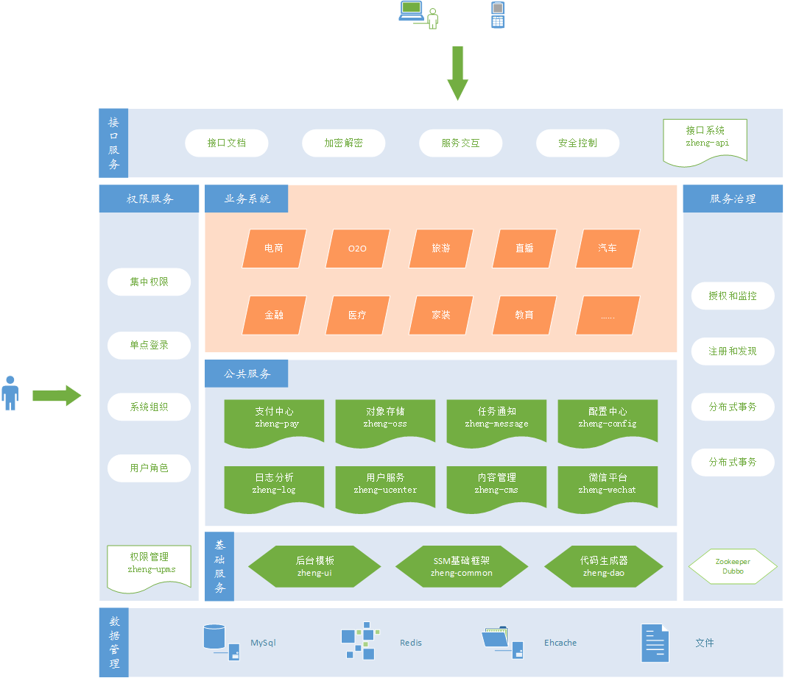

#### 模块依赖

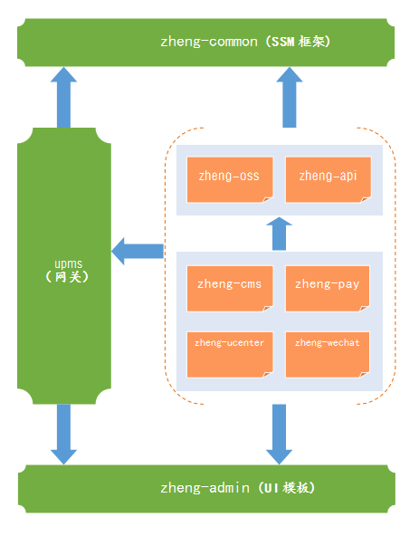

#### 模块介绍

> zheng-common

Spring+SpringMVC+Mybatis框架集成公共模块，包括公共配置、MybatisGenerator扩展插件、通用BaseService、工具类等。

> zheng-admin

基于bootstrap实现的响应式Material Design风格的通用后台管理系统，`zheng`项目所有后台系统都是使用该模块界面作为前端展示。

> zheng-ui

各个子系统前台thymeleaf模板，前端资源模块，使用nginx代理，实现动静分离。

> zheng-upms

本系统是基于RBAC授权和基于用户授权的细粒度权限控制通用平台，并提供单点登录、会话管理和日志管理。接入的系统可自由定义组织、角色、权限、资源等。用户权限=所拥有角色权限合集+用户加权限-用户减权限，优先级：用户减权限>用户加权限>角色权限

> zheng-oss

文件存储系统，提供四种方案：

- **阿里云** OSS
- **腾讯云** COS
- **七牛云**
- 本地分布式存储

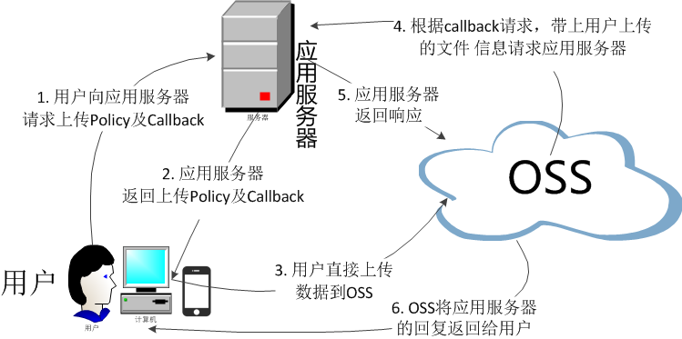

> zheng-api

服务网关，对外暴露统一规范的接口和包装响应结果，包括各个子系统的交互接口、对外开放接口、开发加密接口、接口文档等服务，可在该模块支持验签、鉴权、路由、限流、监控、容错、日志等功能。示例图：

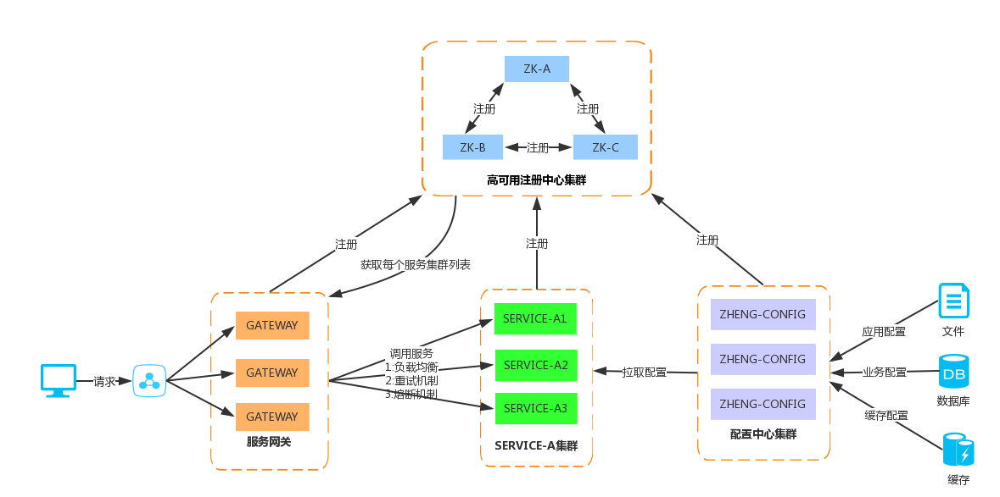


> zheng-cms

内容管理系统：支持多标签、多类目、强大评论的内容管理，有基本单页展示，菜单管理，系统设置等功能。

> zheng-pay

- 一站式支付解决方案，统一下单接口，支持支付宝、微信、网银等多种支付方式。不涉及业务的纯粹的支付平台。

- 统一下单（统一下单接口、统一扫码）、订单管理、数据分析、财务报表、商户管理、渠道管理、对账系统、系统监控。

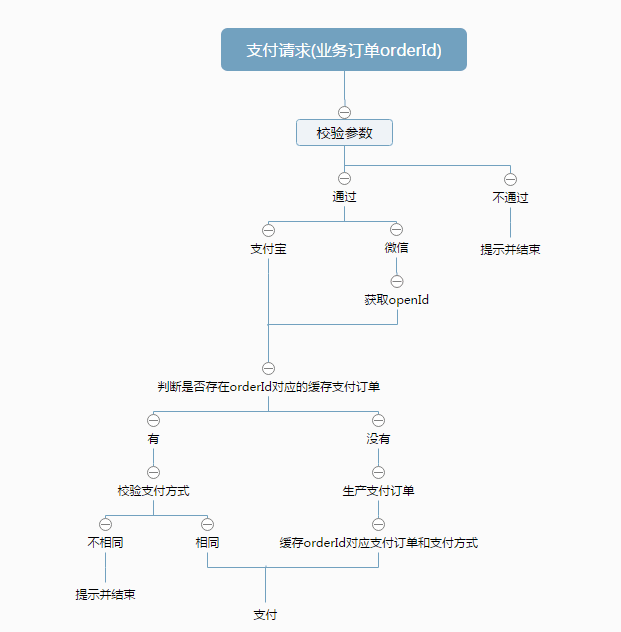

> zheng-ucenter

通用用户管理系统， 实现最常用的用户注册、登录、资料管理、个人中心、第三方登录等基本需求，支持扩展二次开发。

> zheng-wechat-mp

微信公众号管理平台，除实现官网后台自动回复、菜单管理、素材管理、用户管理、消息群发等基础功能外，还有二维码推广、营销活动、微网站、会员卡、优惠券等。

> zheng-wechat-app 

微信小程序后台

> zheng-message

基于Netty实现SocketIO的实时推送系统。支持命名空间、二进制数据、SSL、ACK等功能。

## 环境搭建（QQ群内有“zheng环境搭建和系统部署文档.doc”）

#### 开发工具:
- MySql: 数据库
- jetty: 开发服务器
- Tomcat: 应用服务器
- SVN|Git: 版本管理
- Nginx: 反向代理服务器
- Varnish: HTTP加速器
- IntelliJ IDEA: 开发IDE
- PowerDesigner: 建模工具
- Navicat for MySQL: 数据库客户端

#### 开发环境：
- Jdk7+
- Mysql5.5+
- Redis
- Zookeeper
- ActiveMQ
- Dubbo-admin
- Dubbo-monitor

### 工具安装

环境搭建和系统部署文档(作者：小兵，QQ群共享提供下载)

### 资源下载

- JDK7 [http://www.oracle.com/technetwork/java/javase/downloads/java-archive-downloads-javase7-521261.html](http://www.oracle.com/technetwork/java/javase/downloads/java-archive-downloads-javase7-521261.html "JDK7")
- Maven [http://maven.apache.org/download.cgi](http://maven.apache.org/download.cgi "Maven")
- Redis [https://redis.io/download](https://redis.io/download "Redis")
- ActiveMQ [http://activemq.apache.org/download-archives.html](http://activemq.apache.org/download-archives.html "ActiveMQ")
- ZooKeeper [http://www.apache.org/dyn/closer.cgi/zookeeper/](http://www.apache.org/dyn/closer.cgi/zookeeper/ "ZooKeeper")
- Dubbo [http://dubbo.io/Download-zh.htm](http://dubbo.io/Download-zh.htm "Dubbo")
- Elastic Stack [https://www.elastic.co/downloads](https://www.elastic.co/downloads "Elastic Stack")
- Nginx [http://nginx.org/en/download.html](http://nginx.org/en/download.html "Nginx")
- Jenkins [http://updates.jenkins-ci.org/download/war/](http://updates.jenkins-ci.org/download/war/ "Jenkins")
- dubbo-admin-2.5.3 [http://download.csdn.net/detail/shuzheng5201314/9733652](http://download.csdn.net/detail/shuzheng5201314/9733652 "dubbo-admin-2.5.3")
- dubbo-admin-2.5.4-SNAPSHOT-jdk8 [http://download.csdn.net/detail/shuzheng5201314/9733657](http://download.csdn.net/detail/shuzheng5201314/9733657 "dubbo-admin-2.5.4-SNAPSHOT-jdk8")
- 更多资源请加QQ群

## 开发指南:

- 1、本机安装Jdk7、Mysql、Redis、Zookeeper、ActiveMQ并**启动相关服务**，使用默认配置默认端口即可
- 2、克隆源代码到本地并打开，**推荐使用IntelliJ IDEA**，本地编译并安装到本地maven仓库

### 修改本地Host

- 127.0.0.1	ui.zhangshuzheng.cn
- 127.0.0.1	upms.zhangshuzheng.cn
- 127.0.0.1	cms.zhangshuzheng.cn
- 127.0.0.1	pay.zhangshuzheng.cn
- 127.0.0.1	ucenter.zhangshuzheng.cn
- 127.0.0.1	wechat.zhangshuzheng.cn
- 127.0.0.1	api.zhangshuzheng.cn
- 127.0.0.1	oss.zhangshuzheng.cn
- 127.0.0.1 config.zhangshuzheng.cn

- 127.0.0.1	zkserver
- 127.0.0.1	rdserver
- 127.0.0.1	dbserver
- 127.0.0.1	mqserver

### 编译流程

maven编译安装zheng/pom.xml文件即可

### 启动顺序（后台）

> 准备工作

- 新建zheng数据库，导入project-datamodel文件夹下的zheng.sql

- 修改各dao模块和rpc-service模块的redis.properties、jdbc.properties、generator.properties数据库连接等配置信息，其中master.redis.password、master.jdbc.password、slave.jdbc.password、generator.jdbc.password密码值使用了AES加密，请使用com.zheng.common.util.AESUtil工具类修改这些值

- 启动Zookeeper、Redis、ActiveMQ、Nginx（配置文件参考project-tools/nginx下的*.conf文件）

> **zheng-upms**

- 首先启动 zheng-upms-rpc-service(直接运行src目录下的ZhengUpmsRpcServiceApplication#main方法启动) => zheng-upms-server(jetty)，然后按需启动对应子系统xxx的zheng-xxx-rpc-service(main方法) => zheng-xxx-webapp(jetty)

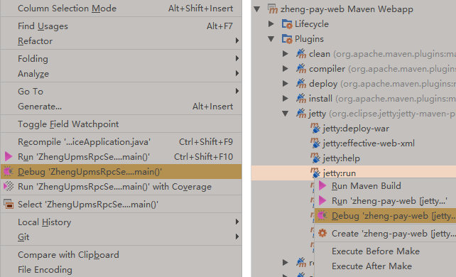

- 访问 [http://upms.zhangshuzheng.cn:1111/](http://upms.zhangshuzheng.cn:1111/ "统一后台地址")，子系统菜单已经配置到zheng-upms权限中，不用直接访问子系统，默认帐号密码：admin/123456

- 登录成功后，可在右上角切换已注册系统访问

> **zheng-cms**

- zheng-cms-admin：启动ActiveMQ-启动 => 启动zheng-rpc-service => 启动zheng-cms-admin

- zheng-cms-web：启动nginx代理zheng-ui静态资源，配置文件可参考 [nginx.conf](http://git.oschina.net/shuzheng/zheng/attach_files)

> **zheng-oss**

- 首先启动zheng-oss-web服务

- 开发阶段，如果zheng-oss-web没有公网域名，推荐使用`ngrok`内网穿透工具，为开发环境提供公网域名，实现上传回调

- 启动nginx代理zheng-ui静态资源


### 开发演示（QQ群内有“zheng十分钟视频：从检出到启动.wmv”）

- 创建数据表（建议使用PowerDesigner）

- 直接运行对应项目dao模块中的generator.main()，可自动生成单表的CRUD功能和对应的model、example、mapper、service代码

    - 生成的model和example均已实现Serializable接口，支持分布式

    - 已包含抽象类BaseServiceImpl，只需要继承抽象类并传入泛型参数，即可默认实现mapper接口所有方法，特殊需求直接扩展即可
    
    - BaseServiceImpl默认已实现四种根据条件分页接口
     
        - selectByExampleWithBLOBsForStartPage()
        
        - selectByExampleForStartPage()
        
        - selectByExampleWithBLOBsForOffsetPage()
        
        - selectByExampleForOffsetPage()

    - BaseServiceImpl方法根据读写操作自动切换主从数据源，继承的扩展接口，可手动通过`DynamicDataSource.setDataSource(DataSourceEnum.XXX.getName())`指定数据源

- 启动流程：优先rcp-service服务提供者，再启动其他webapp

- 扩展流程：可扩展和拆分rpc-api和rpc-service模块，可按微服务拆分或场景拆分

### 部署方式（QQ群内有“zheng十分钟视频：从打包到linux服务器部署.wmv”）

- war包项目：使用tomcat等web容器启动

- rpc-service服务提供者jar包：将打包后的zheng-xxx-rpc-service-assembly.tar.gz文件解压，使用bin目录的管理脚本运行即可，支持优雅停机。

### 框架规范约定

约定优于配置(convention over configuration)，此框架约定了很多编程规范，下面一一列举：

```

- service类，需要在叫名`service`的包下，并以`Service`结尾，如`CmsArticleServiceImpl`

- controller类，需要在以`controller`结尾的包下，类名以Controller结尾，如`CmsArticleController.java`，并继承`BaseController`

- spring task类，需要在叫名`task`的包下，并以`Task`结尾，如`TestTask.java`

- mapper.xml，需要在名叫`mapper`的包下，并以`Mapper.xml`结尾，如`CmsArticleMapper.xml`

- mapper接口，需要在名叫`mapper`的包下，并以`Mapper`结尾，如`CmsArticleMapper.java`

- model实体类，需要在名叫`model`的包下，命名规则为数据表转驼峰规则，如`CmsArticle.java`

- spring配置文件，命名规则为`applicationContext-*.xml`

- 类名：首字母大写驼峰规则；方法名：首字母小写驼峰规则；常量：全大写；变量：首字母小写驼峰规则，尽量非缩写

- springmvc配置加到对应模块的`springMVC-servlet.xml`文件里

- 配置文件放到`src/main/resources`目录下

- 静态资源文件放到`src/main/webapp/resources`目录下

- jsp文件，需要在`/WEB-INF/jsp`目录下

- `RequestMapping`和返回物理试图路径的url尽量写全路径，如：`@RequestMapping("/manage")`、`return "/manage/index"`

- `RequestMapping`指定method

- 模块命名为`项目`-`子项目`-`业务`，如`zheng-cms-admin`

- 数据表命名为：`子系统`_`表`，如`cms_article`

- 更多规范，参考[[阿里巴巴Java开发手册] http://git.oschina.net/shuzheng/zheng/attach_files

```

## 演示地址

演示地址： [http://upms.zhangshuzheng.cn/](http://47.93.195.63/zheng-upms-server/sso/login?backurl=http%3A%2F%2F47.93.195.63%2Fzheng-upms-server%2Fmanage%2Findex "演示地址")

### 预览图
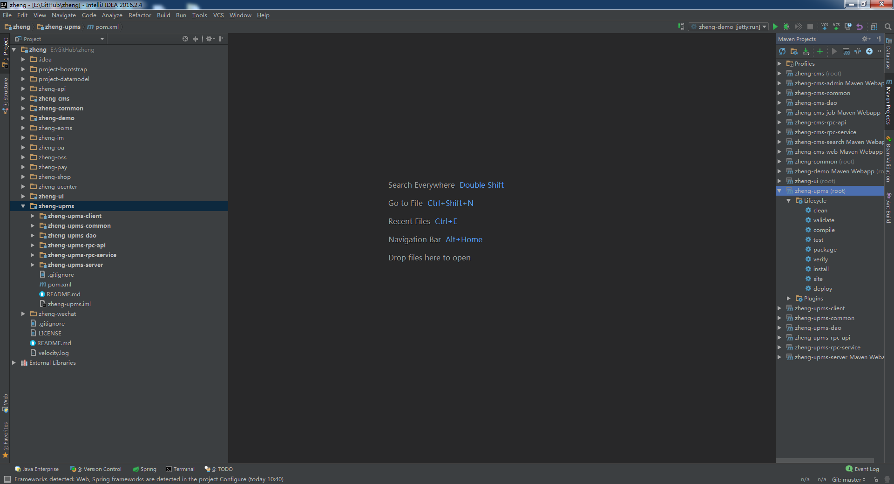
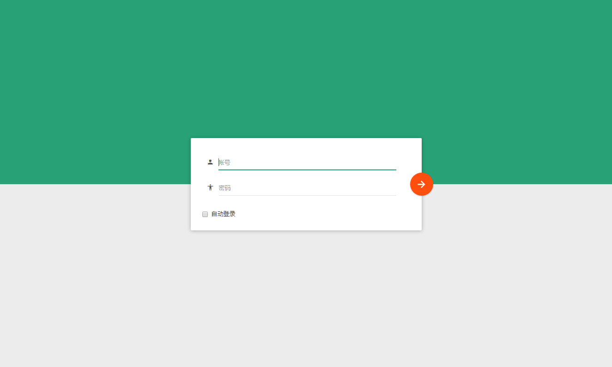

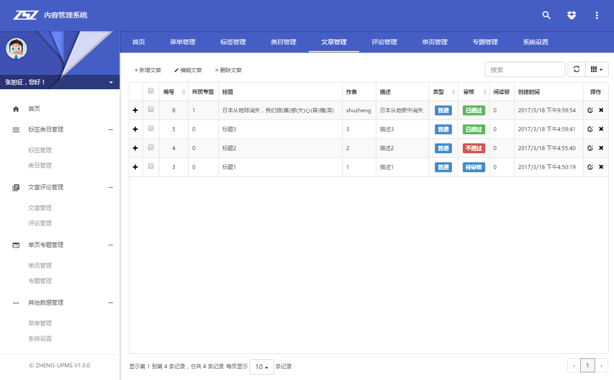
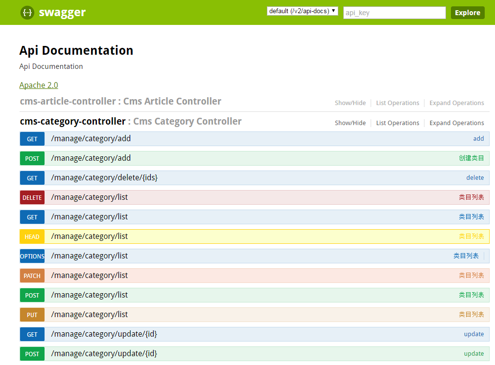

### 数据模型
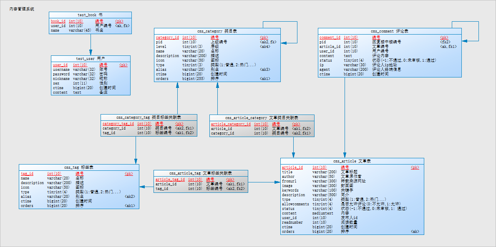

### 拓扑图
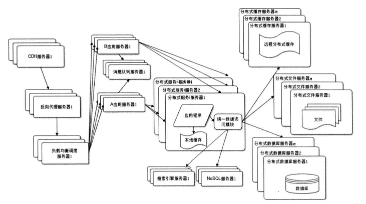

### 开发进度
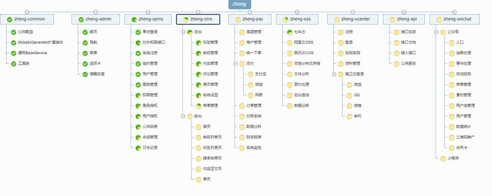

### 参与开发

首先谢谢大家支持，如果你希望参与开发，欢迎通过[Github](https://github.com/shuzheng/zheng "Github")上fork本项目，并Pull Request您的commit。

### 常见问题

- Eclipse下，dubbo找不到dubbo.xsd报错，不影响使用，如果要解决，可参考 [http://blog.csdn.net/gjldwz/article/details/50555922](http://blog.csdn.net/gjldwz/article/details/50555922)

- 报zheng-xxx.jar包找不到,请按照文档编译顺序，将源代码编译并安装到本地maven仓库

- zheng-cms-admin启动卡住：因为没有启动activemq

- zheng-upms-server访问报session不存在：因为没有启动redis服务

- 界面没有样式：因为zheng-admin没有编译安装到本地仓库

- linux下执行rpc-service脚本报“bin/bash^M 坏的解释器”，使用sed -i 's/\r$//' filename删除脚本中\r字符

## 附件

### zheng相关博客

- [zheng-1：环境搭建及项目部署](http://www.jianshu.com/p/b2fb42e17b58 "zheng-1：环境搭建及项目部署")

- [zheng项目新建一个module学习学习](http://blog.csdn.net/u014449653/article/details/78294862 "zheng项目新建一个module学习学习")

- [zheng项目系统简单的分析记录](http://blog.csdn.net/u014449653/article/details/78319135 "zheng项目系统简单的分析记录")

- [zheng项目-从rpc-service开始！](http://blog.csdn.net/u014449653/article/details/78341171 "zheng项目-从rpc-service开始！")

- [进击zheng项目zheng-umps-server](http://blog.csdn.net/u014449653/article/details/78355849 "进击zheng项目zheng-umps-server")

- [zheng环境搭建](http://blog.csdn.net/u011781521/article/details/79012311 "zheng环境搭建")

- [让zheng支持activiti工作流](http://blog.csdn.net/ctmold/article/details/79082406 "让zheng支持activiti工作流")

- [让zheng更完美地支持ajax提交的json数据](http://blog.csdn.net/ctmold/article/details/79081483 "让zheng更完美地支持ajax提交的json数据")

### 优秀文章和博客

- [创业互联网公司如何搭建自己的技术框架](http://shuzheng5201314.iteye.com/blog/2330151 "创业互联网公司如何搭建自己的技术框架")

- [微服务实战](https://segmentfault.com/a/1190000004634172 "微服务实战")

- [单点登录原理与简单实现](http://shuzheng5201314.iteye.com/blog/2343910 "单点登录原理与简单实现")

- [ITeye论坛关于权限控制的讨论](http://www.iteye.com/magazines/82 "ITeye论坛关于权限控制的讨论")

- [RBAC新解：基于资源的权限管理(Resource-Based Access Control)](http://globeeip.iteye.com/blog/1236167 "RBAC新解：基于资源的权限管理(Resource-Based Access Control)")

- [网站架构经验随笔](http://jinnianshilongnian.iteye.com/blog/2289904 "网站架构经验随笔")

- [支付系统架构](http://shuzheng5201314.iteye.com/blog/2355431 "支付系统架构")

- [Spring整合JMS](http://elim.iteye.com/blog/1893038 "Spring整合JMS")

- [跟我学Shiro目录贴](http://jinnianshilongnian.iteye.com/blog/2018398 "跟我学Shiro目录贴")

- [跟我学SpringMVC目录汇总贴](http://jinnianshilongnian.iteye.com/blog/1752171 "跟我学SpringMVC目录汇总贴")

- [跟我学spring3 目录贴](http://jinnianshilongnian.iteye.com/blog/1482071 "跟我学spring3 目录贴")

- [跟我学OpenResty(Nginx+Lua)开发目录贴](http://jinnianshilongnian.iteye.com/blog/2190344 "跟我学OpenResty(Nginx+Lua)开发目录贴")

- [Redis中文网](http://www.redis.net.cn/ "Redis中文网")

- [读懂Redis并配置主从集群及高可用部署](http://mp.weixin.qq.com/s?__biz=MzIxNTYzOTQ0Ng==&mid=2247483668&idx=1&sn=cd31574877d38cf7ff9c047b86c9bf23&chksm=979475eda0e3fcfb6b5006bcd19c5a838eca9e369252847dbdf97820bf418201dd75c1dadda3&mpshare=1&scene=23&srcid=0117KUiiITwi2ETRan16xRVg#rd "读懂Redis并配置主从集群及高可用部署")

- [Redis哨兵-实现Redis高可用](http://redis.majunwei.com/topics/sentinel.html "Redis哨兵-实现Redis高可用")

- [ELK(ElasticSearch, Logstash, Kibana)搭建实时日志分析平台](http://www.open-open.com/lib/view/open1451801542042.html "ELK(ElasticSearch, Logstash, Kibana)搭建实时日志分析平台")

- [Nginx基本功能极速入门](http://xxgblog.com/2015/05/17/nginx-start/ "Nginx基本功能极速入门")

- [mybatis-genarator 自定义插件](https://my.oschina.net/alexgaoyh/blog/702791 "mybatis-genarator 自定义插件")

- [Elasticsearch权威指南（中文版）](https://es.xiaoleilu.com/510_Deployment/20_hardware.html "Elasticsearch权威指南（中文版）")

- [springMVC对简单对象、Set、List、Map的数据绑定和常见问题.](http://blog.csdn.net/z_dendy/article/details/12648641 "springMVC对简单对象、Set、List、Map的数据绑定和常见问题.")

- [如何细粒度地控制你的MyBatis二级缓存](http://blog.csdn.net/luanlouis/article/details/41800511 "如何细粒度地控制你的MyBatis二级缓存")

- [Git 在团队中的最佳实践--如何正确使用Git Flow](hhttps://www.atlassian.com/git/tutorials/comparing-workflows/gitflow-workflow "Git 在团队中的最佳实践--如何正确使用Git Flow")

- [做个男人，做个成熟的男人，做个有城府的男人](http://shuzheng5201314.iteye.com/blog/1387820 "做个男人，做个成熟的男人，做个有城府的男人")


### 在线小工具

- [在线Cron表达式生成器](http://cron.qqe2.com/ "在线Cron表达式生成器")

- [在线工具 - 程序员的工具箱](http://tool.lu/ "在线工具 - 程序员的工具箱")

### 在线文档

- [JDK7英文文档](http://tool.oschina.net/apidocs/apidoc?api=jdk_7u4 "JDK7英文文档")

- [Spring4.x文档](http://spring.oschina.mopaas.com/ "Spring4.x文档")

- [Mybatis3官网](http://www.mybatis.org/mybatis-3/zh/index.html "Mybatis3官网")

- [Dubbo官网](http://dubbo.io/ "Dubbo官网")

- [Nginx中文文档](http://tool.oschina.net/apidocs/apidoc?api=nginx-zh "Nginx中文文档")

- [Freemarker在线手册](http://freemarker.foofun.cn/ "Freemarker在线中文手册")

- [Velocity在线手册](http://velocity.apache.org/engine/devel/developer-guide.html "Velocity在线手册")

- [Bootstrap在线手册](http://www.bootcss.com/ "Bootstrap在线手册")

- [Git官网中文文档](https://git-scm.com/book/zh/v2 "Git官网中文文档")

- [Thymeleaf](http://www.thymeleaf.org/doc/tutorials/3.0/thymeleafspring.html "Thymeleaf")

## 许可证

[MIT](LICENSE "MIT")
