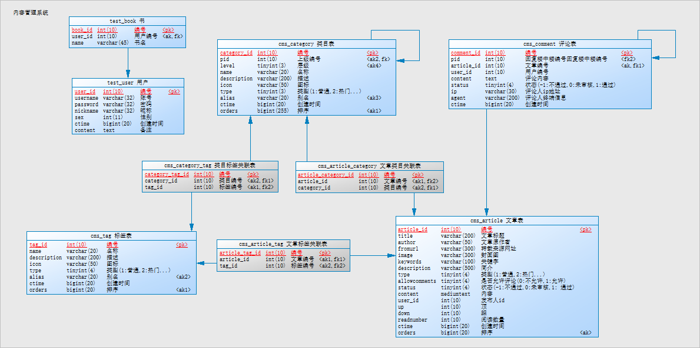

## zheng

# 介绍
```
zheng
├── common 公共模块
├── cms 内容管理系统
|    ├── cms-dao
|    ├── cms-service
|    └── cms-web
├── qa 问答系统
|    ├── qa-dao
|    ├── qa-service
|    └── qa-web
├── upms 通用用户权限系统
|    ├── upms-dao
|    ├── upms-service
|    └── upms-admin
├── pay 支付系统
|    ├── pay-service
|    ├── pay-sdk
|    └── pay-demo
├── ucenter 用户系统
|    ├── ucenter-dao
|    ├── ucenter-service
|    └── ucenter-home
├── wechat 微信系统
|    ├── wechat-mp 公众号
|    |    ├── wechat-mp-dao
|    |    ├── wechat-mp-service
|    |    └── wechat-mp-admin
|    └── wechat-app 小程序
|         ├── wechat-app-sdk
|         └── wechat-app-example
├── api 接口系统
└── oss 对象存储系统
     ├── oss-sdk
     └── oss-admin
```

# 后端技术:
* Spring
* SpringMVC: MVC框架
* MyBatis: ORM框架
* MyBatis Generator: 代码生成
* Druid: 数据库连接池
* Spring secutity|Shiro: 权限认证
* Thymeleaf: 模板引擎
* ZooKeeper: 协调服务
* Dubbo: 远程服务调用
* TBSchedule: 任务调度
* Quartz: 定时任务
* Ehcache: 二级缓存
* Redis: 分布式缓存存储
* ActiveMQ: 消息队列
* Solr: 检索
* Maven: 项目管理(Gradle)
* Qiniu: 云存储
* Jenkins: 持续集成
* Log4J: 日志管理
* Protobuf|json: 数据传输 
* Spring-boot
* Swagger2: 接口文档


# 前端技术:
* jQuery
* Bootstrap
* jQuery EasyUI
* AngularJs
* Webpack
* Node.js
* Electron
* NW.js(Node-Webkit)
* Material Design


# 开发环境:
* MySql: 数据库
* jetty: 开发服务器
* Tomcat: 应用服务器
* SVN: 版本管理
* Nginx: 反向代理服务器
* Varnish: 内存缓存
* Navicat for MySQL: 数据库客户端管理
* IntelliJ IDEA: 开发IDE
* PowerDesigner: 建模工具


# 数据模型

