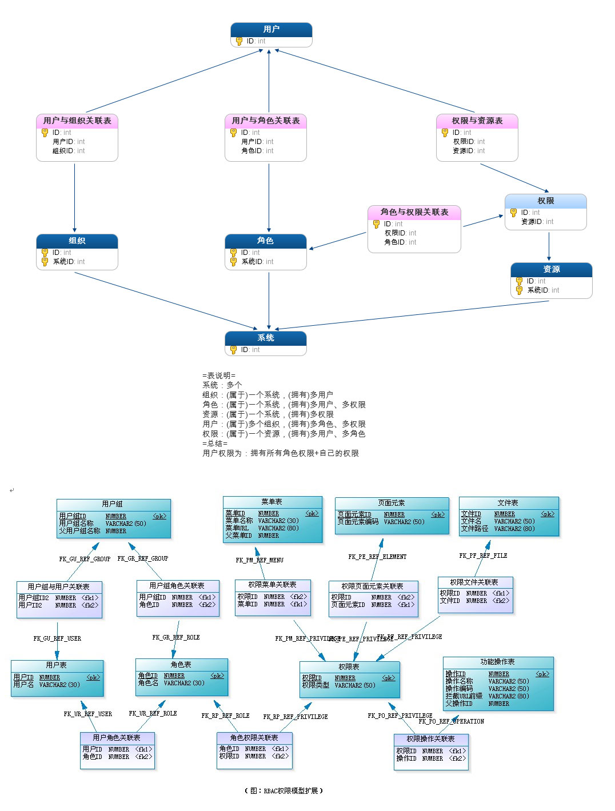

# zheng-upms 用户权限管理系统

## 介绍

**演示地址**：[http://www.zhangshuzheng.cn/zhengAdmin](http://www.zhangshuzheng.cn/zhengAdmin)

**系统简介**：本系统是基于RBAC授权和基于用户授权的细粒度权限控制通用平台，并提供单点登录、会话管理和日志管理。接入的系统可自由定义组织、角色、权限、资源等。

## 系统功能概述：

**系统组织管理**：系统和组织增加、删除、修改、查询功能。

**用户角色管理**：用户和角色增加、删除、修改、查询功能。

**资源权限管理**：资源和权限增加、删除、修改、查询功能。

**权限分配管理**：提供给角色和用户的权限增加、删除、修改、查询功能。

**单点登录(SSO)**：提供统一用户单点登录认证、用户鉴权功能。

**用户会话管理**：提供分布式用户会话管理

# 数据模型

# 单点登录

